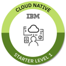

## Workshop: Get your Java Microservice up and running!

This workshop demonstrates how to build a Microservice with Java and how to deploy it to Kubernetes on the IBM Cloud. The Microservice in this workshop is kept as simple as possible, so that it can be used as a starting point for other Microservices. The Microservice has been developed with Java EE and [Eclipse MicroProfile](https://microprofile.io/).

* > Useful playlist on YouTube related this workshop: [Build and deploy a microservice to Kubernetes](https://ibm.biz/BdzVRY)

### What's a Microservice?

There are small variations of microservice definitions out there, here is one definition of [Gartner](https://www.gartner.com/en/information-technology/glossary/microservice):

* > A microservice is a service-oriented application component that is tightly scoped, strongly encapsulated, loosely coupled, independently deployable and independently scalable.

* > [More additional information related to microservices, provided by IBM.](https://www.ibm.com/cloud/learn/microservices)

### Architecture

In the gif below you see the Authors Microservice, which we will run locally in a Docker container.
We will deploy this Authors Microservice to Kubernetes on IBM Cloud. 
The gif shows the steps of exercise 3 how we deploy that Microservice to IBM Cloud.

### Estimated time and level

|  Time | Level  |
| - | - |
| one hour | beginners |

### Objectives

After you complete this workshop, you'll understand the following topics:

* Java implementation of a Cloud Native RESTFul Java Microservice built on open technologies MicroProfile and OpenLiberty. 
* Describe how to effectively build and run a Microservice on a local machine in a container
* Understands the steps needed to deploy a single Microservice to Kubernetes and on the IBM Cloud Kubernetes service

You can verify your learning in the **Cloud Native Starter Badge - Level 1**

> To be prepared to pass the test of the [**Cloud Native Starter Badge - Level 1**](http://ibm.biz/cloud-native-starter-level-1-badge), you should run the hands-on workshop **virtual** or **face to face**, but you can also run the workshop as a **self service**.

### About this workshop

The introductory page of the workshop is broken down into the following sections:

* [Agenda](#agenda)
* [Compatibility](#compatibility)
* [Technology Used](#technology-used)
* [Credits](#credits)
* [What`s next?](#whats-next?)

### Agenda

These are the sections of this workshop, go through all of them in sequence, start with `Setup local and IBM Cloud Environment` :

 1. [Setup local and IBM Cloud Environment](pre-work/README.md) 
 2. [Running the Java Microservice locally](exercise-01/README.md) 
 3. [The Java implementation](exercise-02/README.md) 
 4. [Deploy to the Kubernete](exercise-03/README.md) 

### Compatibility

This workshop has been tested on the following platforms:

* **IBM Cloud Kubernetes Service**: Kubernetes Version 1.17 on IBM Cloud
* **Docker desktop**: Version 2.3.0.4

### Technology Used

* [Microservices architecture](https://en.wikipedia.org/wiki/Microservices)
* [Jakarta EE](https://jakarta.ee/)
* [MicroProfile](https://microprofile.io/)
* [Open Liberty](https://openliberty.io/)
* [git](https://git-scm.com/book/en/v2/Getting-Started-Installing-Git) 
* [cURL](https://curl.haxx.se/download.html)
* [IBM Cloud CLI](https://cloud.ibm.com/docs/home/tools)
  [IBM Cloud CLI releases](https://github.com/IBM-Cloud/ibm-cloud-cli-release/releases)
* [Docker](https://docs.docker.com/v17.12/install/)
* [kubectl](https://kubernetes.io/docs/tasks/tools/install-kubectl/)

### Credits

* [Niklas Heidloff](https://twitter.com/nheidloff)
* [Harald Uebele](https://twitter.com/Harald_U)
* [Thomas Südbröcker](https://twitter.com/tsuedbroecker)

### Additional resources

[Here](https://github.com/IBM/cloud-native-starter#documentation---kubernetes-and-microprofile) are some documentations of the project.

