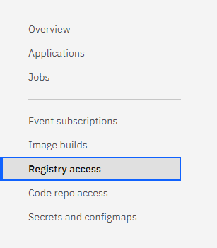
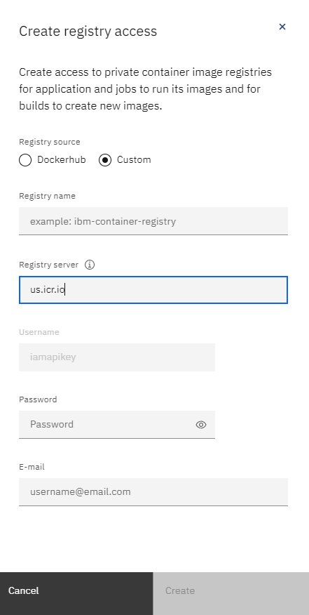
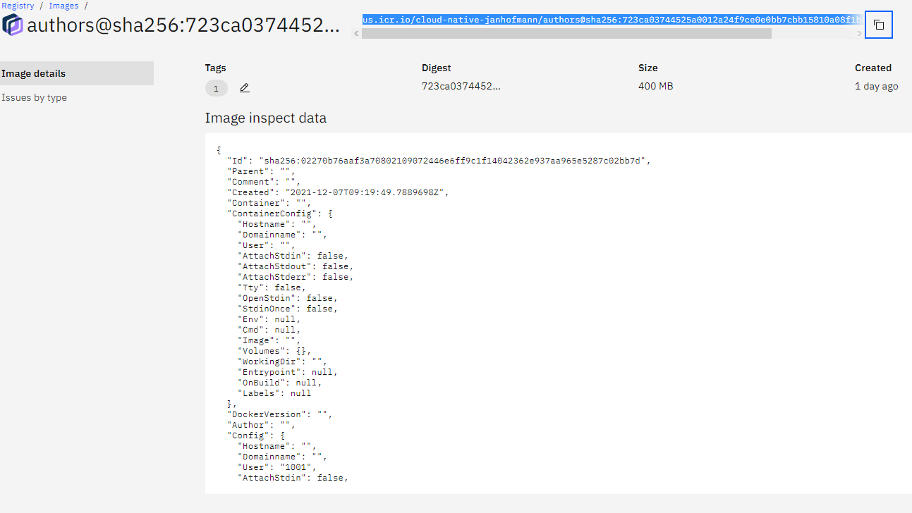
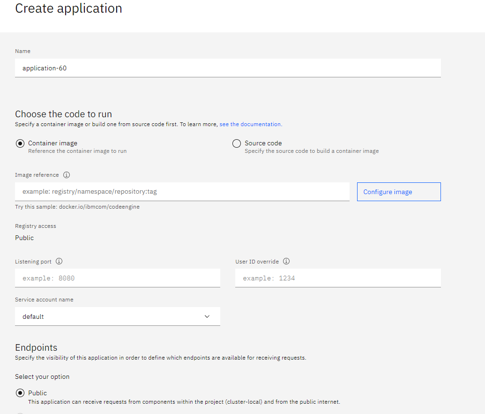
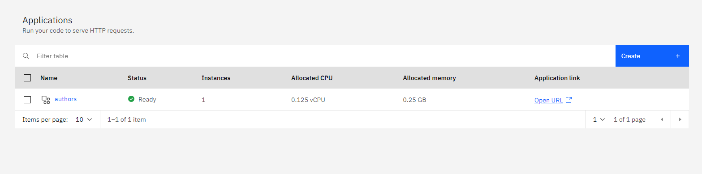

# Deploy to Code Engine

In this optional lab we will deploy our application to the `IBM Cloud Code Engine`.

### Prerequisites

You need to upload the container image to the `IBM Cloud Container Registry`, if you haven't done that already (please follow the steps in exercise 3 "Deploy to Kubernetes").

### Create a Code Engine Project

> Note: you need a `PayAsYouGo` Account, in order to use `Code Engine`.

In order to create a `Code Engine` project, you can either search for `Code Engine` in your `IBM Cloud` Dashboard and navigate to `Projects`, or you can follow this [link](https://cloud.ibm.com/codeengine/projects) instead.

Now you press `Create`, enter a Name, select a suitable location, select `Default` as your resource group and click `Create` again.

Once you've done that, you should be able to see your newly created project [here](https://cloud.ibm.com/codeengine/projects).

### Prepare Container Registry

#### Step 1: Create an Access Key for your Registry

In order for `Code Engine` to access your container image, we need to create an API-Key.

Open the following link and click on `Create an IBM Cloud API key`.


```
https://cloud.ibm.com/iam/apikeys
```

Enter a name and click `Create`. Now copy and save the API-key, as it won't be shown again.


#### Step 2: Create a `Registry Access`

Follow this [link](https://cloud.ibm.com/codeengine/projects), and click on the project you created earlier.

On the left side you it should look like this:



Click on `Registry access` and click on `Create`.


Give it a name, and input the following parameters:

1. Registry source: `Custom`
2. Registry server: the server your container registry is located in for example `us.icr.io`
3. Password: The API-key you created earlier
4. E-mail: Your E-mail




Afterwards click `Create` again.

### Deploy to Code Engine

#### Step 1: Get the location of your container image

In order to create our `Code Engine` deployment, we need to know the location of our container image.

From the `IBM Cloud` Dashboard, navigate to `Container registry` and click on `Images`. Alternatively, you can follow this [link](https://cloud.ibm.com/registry/images). 

Now look for your image, click on it and copy its link.




#### Step 2: Deploy the application

Navigate to the `Code Engine` project you created earlier, click on `Applications` and press `Create`.

Now you should see something similar to this:



Fill in the following parameters:

1. Name: a suitable name, for example `authors`
2. Select `Container image`
3. Image reference: The link to your container image you copied earlier
4. Registry access: select the `Registry access` you created earlier
5. Listening Port: `3000`
6. Endpoints: `public`

Now scroll down to `Runtime settings` and click on it.

Set both the `Min Number of Instances` as well as the `Max Number of Instances` to `1`, and select `0.125vCPU/0.25 GB` as your `Instance resources`.

Now you press create, and wait a bit for `Code Engine` to deploy your application.

#### Step 3: Verify that the deployment worked

Go to your `Code Engine` Project, and click on `Applications`. If the deployment worked, it should look similar to the following picture.



Click on `Open URL`, and wait for the new browsertab to open. Now add `/openapi/ui/` to the end of the URL to check that your application is working properly.

---

**Congratulations** you have finished this **optional lab**.
