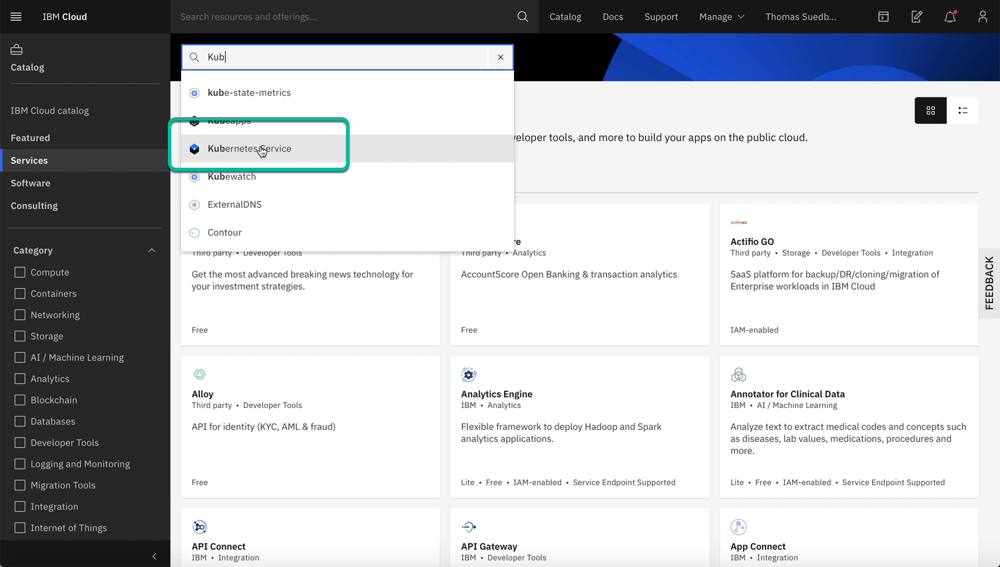
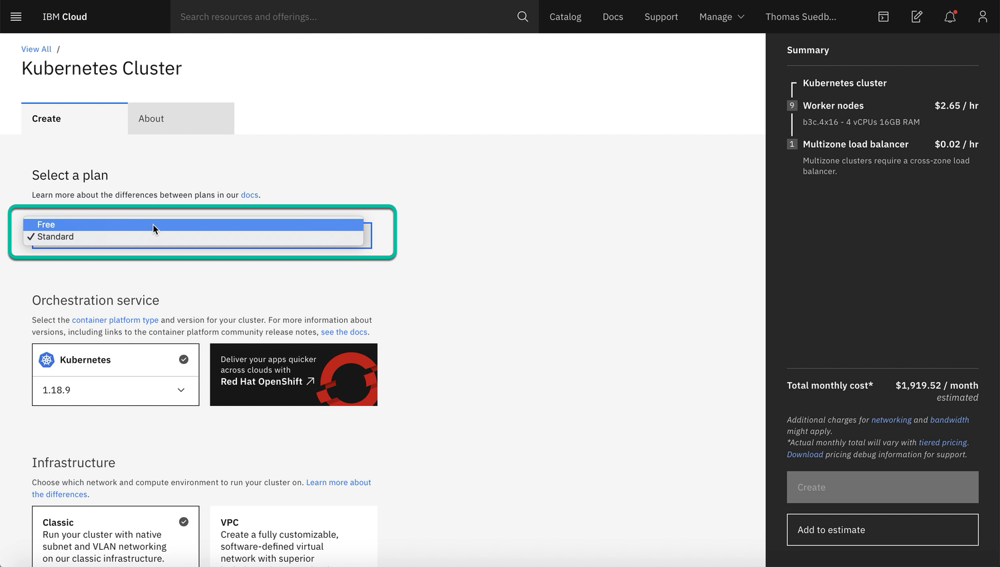
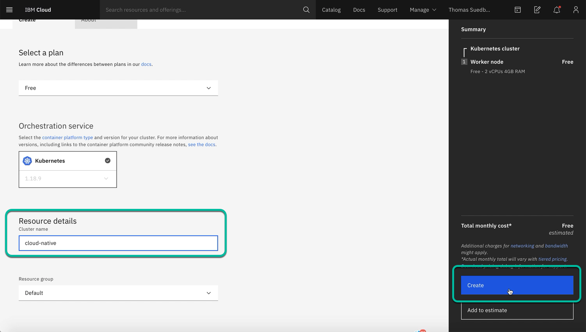
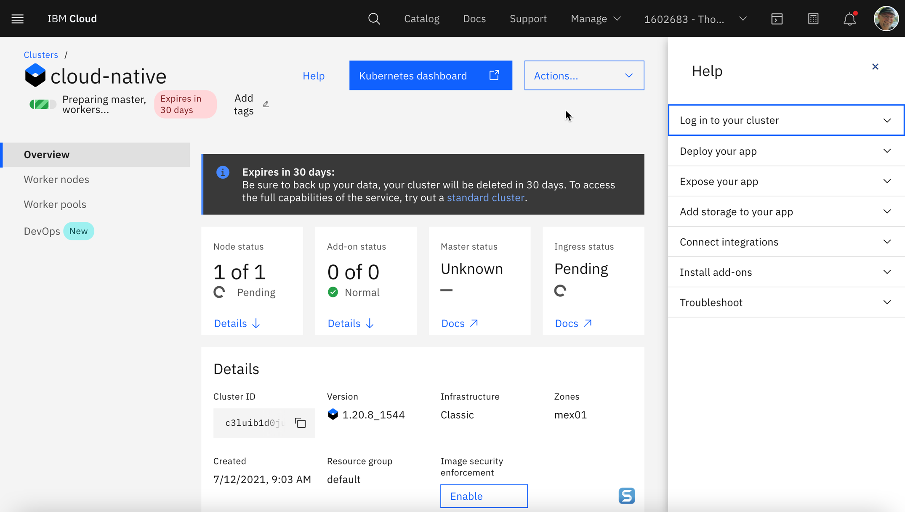

# Create a free IBM Cloud Kubernetes cluster

## Step 1: Logon to IBM Cloud

## Step 2: Select in the menu "Catalog" and search for "Kubernetes Service"

## Step 3: Click on "Kubernetes Service"

## Step 4: Select Free cluster

## Step 5: Click on the Kubernetes Services and select "Free"

Ensure you set following values in the creation dialog:

* Cluster name:     cloud-native
* Resource group:   Default

## Step 6: Press "Create custer"

## Step 7: Now you will be forwarded to your cluster on IBM Cloud and you can verify the status of the creation of your cluster

The creation of the cluster takes up to **20 min**.

---
