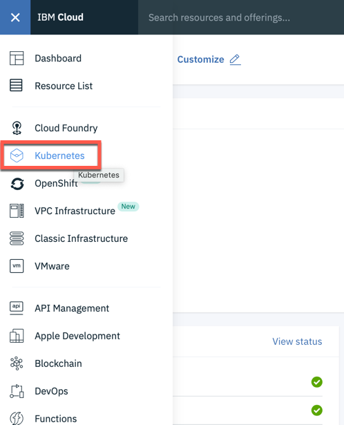
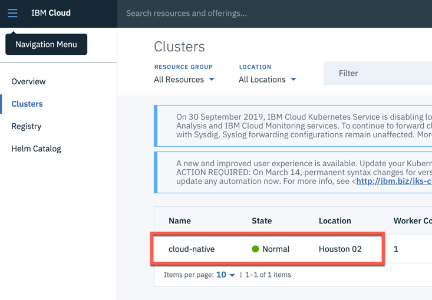
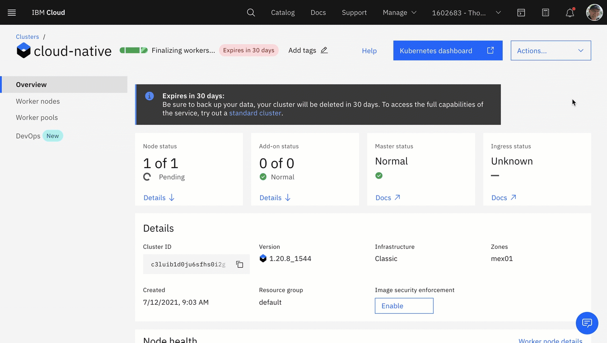
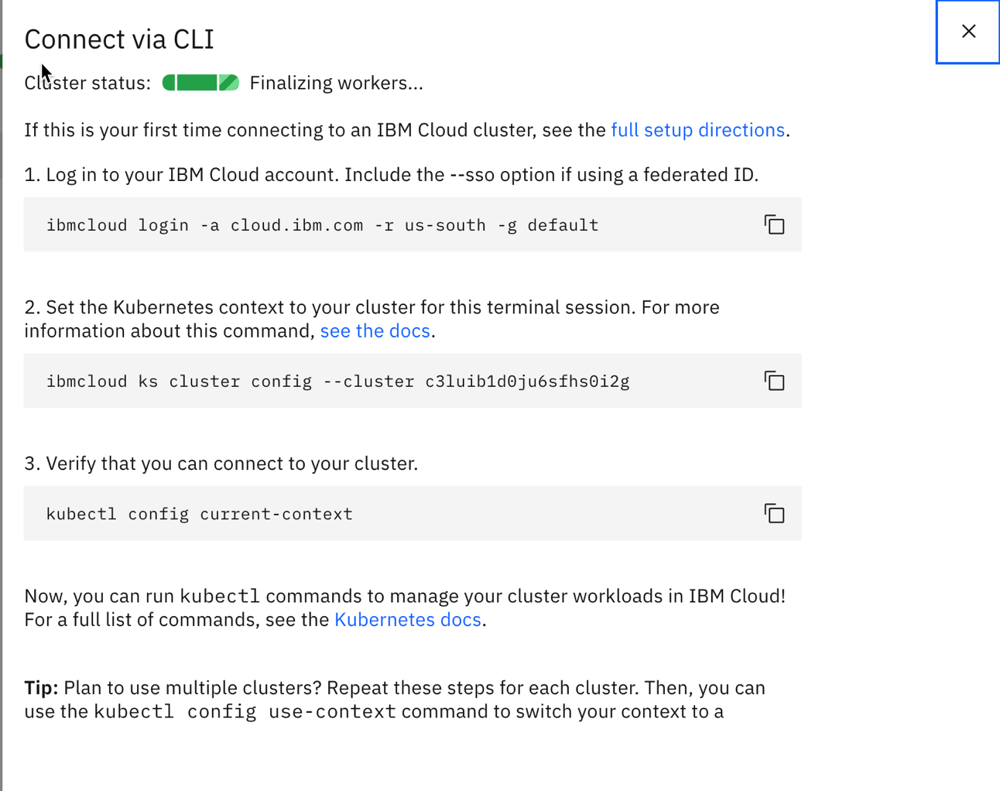

# Verify Access to Kubernetes on the IBM Cloud

This is a preparation for exercise 3, when we will connect to the free Kubernetes cluster in IBM Cloud.

## Step 1: Logon to the IBM Cloud web console

## Step 2: Select **Kubernetes** in the menu

## Step 3: Chose **Clusters** and click on your **Kubernetes cluster**

## Step 4: Ensure you cluster is deployed

_Note:_ Ensure you are in the terminal session with the running Docker container.

## Step 5: Open **Actions** -> **Connect via CLI**

Then follow the steps and insert the commands into your **second** terminal session.

* Connect via CLI

---
