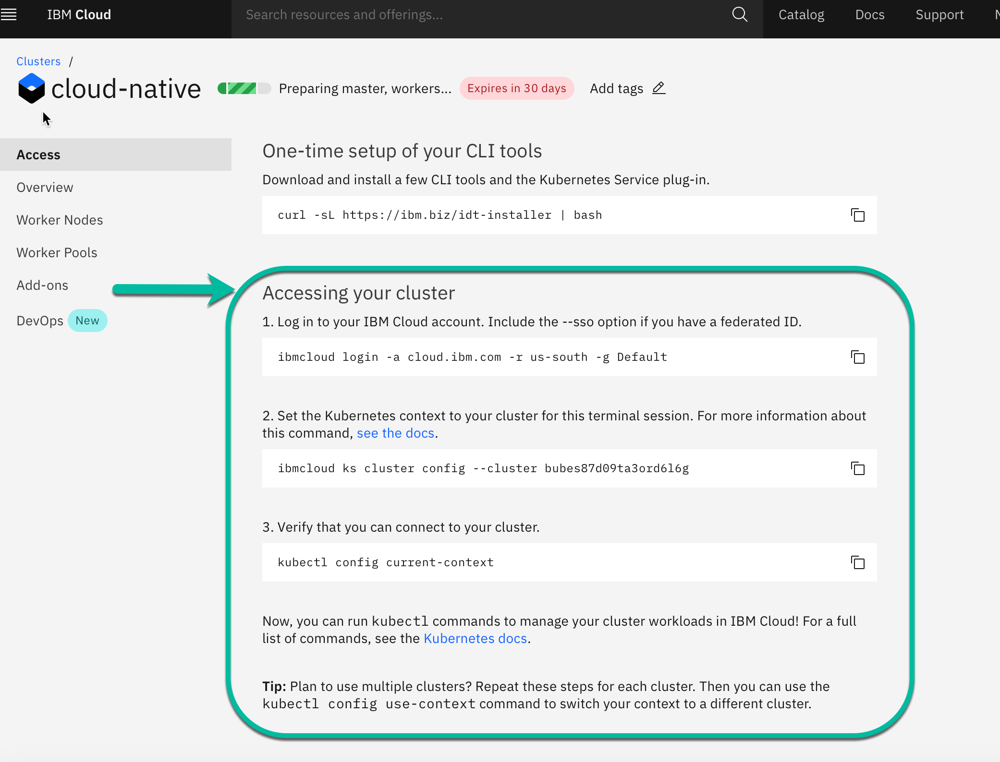

# Verify Access to Kubernetes on the IBM Cloud

This is a preparation for exercise 3, when we will connect to the free Kubernetes cluster in IBM Cloud.

### Step 1: Logon to the IBM Cloud web console

### STEP 2: Select **Kubernetes** in the menu

### STEP 3: Chose **Clusters** and click on your **Kubernetes cluster**

### STEP 4: Follow the steps in the **Access** tab, by starting from **After your cluster provision, gain Access** and insert the commands into your terminal session.

---

__Continue with [Lab 2 - Running the Java Microservice locally](./2-docker.md#lab-2---running-the-java-microservice-locally)__ 
