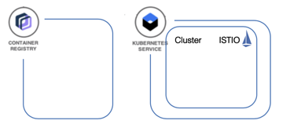

# Overview

In order to run this workshop you need an [IBM Cloud account](https://cloud.ibm.com/registration) and free IBM Cloud Kubernetes Cluster.

To create a free IBM Cloud Kubernetes Cluster you need a **Pay-As-You-Go Account** for IBM Cloud. ([Account Types](https://cloud.ibm.com/docs/account?topic=account-accounts))

We will use the following IBM Cloud Services in this hands-on workshop:

* [IBM Cloud Kubernetes Service](https://cloud.ibm.com/docs/containers?topic=containers-getting-started#getting-started)
* [IBM Cloud Container Registry Service](https://cloud.ibm.com/docs/services/Registry?topic=registry-getting-started#getting-started)

## Tools

We created a Docker image that we use in this workshop.
The Docker image contains all needed CLIs such as:

* [git](https://git-scm.com/book/en/v2/Getting-Started-Installing-Git)
* [curl](https://curl.haxx.se/download.html)
* [IBM Cloud CLI](https://cloud.ibm.com/docs/home/tools)
  * [IBM Cloud CLI releases](https://github.com/IBM-Cloud/ibm-cloud-cli-release/releases)
* [Docker](https://docs.docker.com/v17.12/install/)
* [kubectl](https://kubernetes.io/docs/tasks/tools/install-kubectl/)

So, in order to complete the workshop, you **need** to install [Docker Desktop](https://docs.docker.com/install/) on your local machine. Docker Desktop is available for Mac and Windows and the Docker Engine can be run natively on [Linux](https://docs.docker.com/install/linux).

### We will use two terminal sessions

> * **The first terminal session** is for the developer focused exercises 1 and 2.
>
> * **The second terminal session** is for exercise 3 deploy the Microservice to Kubernetes, here you will work in a preconfigured Container image.

